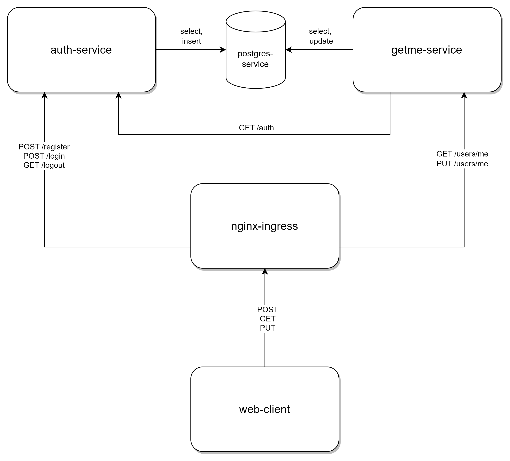
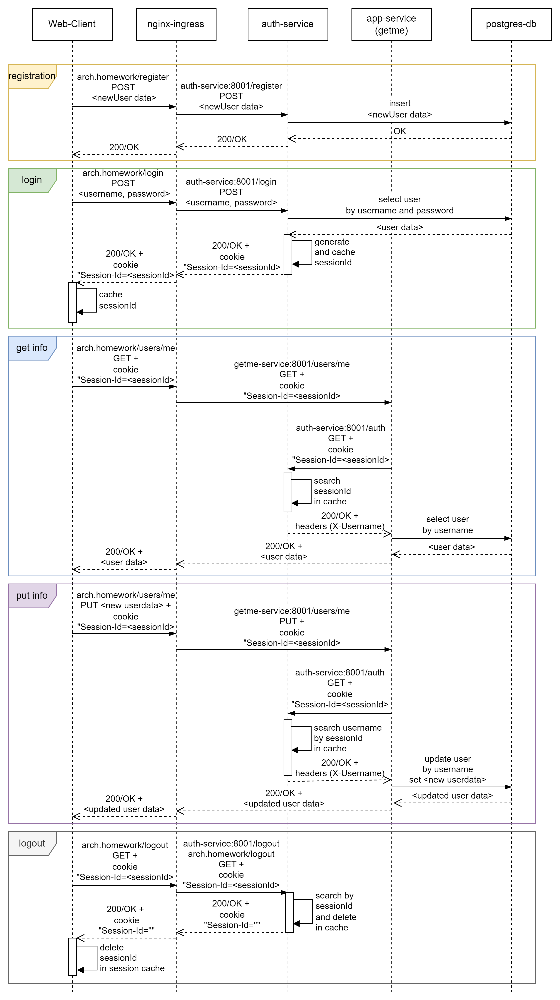

Компонентная схема решения:


Сиквенс диаграмма взаимодействия:



Предпроверки

Убедитесь, что:
1. nginx-ingress установлен и включен в кластере.
2. доменное имя arch.homework роутится на хост, на котором установлен minikube.
3. пути:
     - http://arch.homework/register
     - http://arch.homework/login
     - http://arch.homework/logout
     - http://arch.homework/users/me 
   не используются другими сервисами.

Создаем и делаем дефолтным namespace learning

```
kubectl create ns learning
kubectl config set-context --current --namespace=learning

```

переходим в директорию helm-charts и через helm устанавливаем чарты для БД Postgres, приложения аутентификации, тестового приложения (использующего сервис аутентифкации):

```
helm install postgres

helm install auth

helm install getme 
```

Удостоверьтесь, что все необходимые чарты установлены:

```
helm list -n learning

NAME            NAMESPACE       REVISION        UPDATED                                 STATUS          CHART           APP VERSION
auth            learning        1               2024-01-11 20:55:42.7096731 +0300 MSK   deployed        auth-0.1.0      1.0.0
getme           learning        1               2024-01-11 20:56:51.4199242 +0300 MSK   deployed        getme-0.1.0     1.0.0
postgres        learning        1               2023-12-31 00:58:09.3128492 +0300 MSK   deployed        postgres-0.1.0  1.16.0
```

Используйте коллекцию тестов Postman (postman\auth-test-cluster.postman_collection.json)
Коллекция содержит:
1. Регистрацию пользователя newuser
2. Аутентификацию с пользователем и паролем пользователя newuser
3. Получение информации о текущем пользователе (пользователь авторизован)
4. Редактирование информации о текущем пользователе (пользователь авторизован)
5. Logout пользователя newuser
6. Попытка получения информации о текущем пользователе (пользователь не авторизован, ошибка 401)
7. Попытка редактирование информации о текущем пользователе (пользователь не авторизован, ошибка 401)

